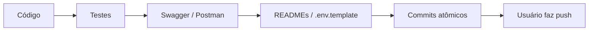

# Keep Docs In Sync

**Autor:** Francisco Stanley Rodrigues Albuquerque  
**Projeto:** Meeting Scribe

## Quando aplicar

**Sempre** que houver mudança de comportamento, contrato, setup ou UX — não só em “tarefas de docs”.

## Checklist por tipo de mudança

### API (backend NestJS)

- [ ] DTOs com `class-validator` + `@ApiProperty` / `@ApiPropertyOptional`
- [ ] Controller com `@ApiTags`, `@ApiOperation` (e responses úteis)
- [ ] Swagger acessível em `/api/docs` reflete o contrato
- [ ] Collection Postman em `docs/postman/meeting-scribe.postman_collection.json`
- [ ] Teste Vitest do use case / domínio relacionado
- [ ] `backend/README.md` se endpoint ou env mudou

### Frontend / Desktop

- [ ] `frontend/README.md` ou `desktop/README.md` se o fluxo de uso mudou
- [ ] Variáveis `NEXT_PUBLIC_*` / desktop documentadas no `.env.template`
- [ ] Prints em `docs/screenshots/` se a UI mudou de forma relevante (script `scripts/capture-screenshots.cjs`)

### Infra / Env / Docker

- [ ] `.env.template` na raiz (fonte única)
- [ ] `docker-compose.yml` + Dockerfiles mencionados no README raiz
- [ ] Scripts `package.json` documentados se novos

### Commits (após docs/testes)

Seguir skill **organize-commits** + rule `.cursor/rules/organize-commits.mdc`:

| Tipo | Use quando |
|------|------------|
| `feat` | Nova capacidade para o usuário/sistema |
| `fix` | Corrige bug |
| `refactor` | Reorganiza sem mudar comportamento externo |
| `perf` | Melhoria de performance (em vez de “improvement”) |
| `docs` | Só documentação |
| `test` | Só testes |
| `build` | Docker, bundler, deps de build |
| `ci` | Pipelines / hooks |
| `chore` | Manutenção (bootstrap, ignore, tooling) |

Evite o tipo inventado `improvement` — prefira `feat`, `refactor` ou `perf`.

Push: **nunca automático**; o usuário faz o push.

## Ordem de trabalho recomendada

## Referências no repo

- Swagger UI: `http://localhost:3001/api/docs`
- Postman: `docs/postman/`
- Env: `.env.template` → `copy .env.template .env`
