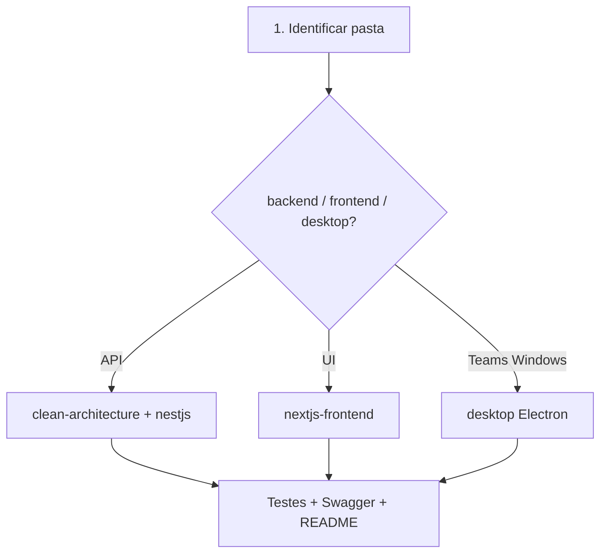

# Meeting Scribe — Development

**Autor:** Francisco Stanley Rodrigues Albuquerque

## Índice de Skills

| Skill | Quando carregar |
|-------|-----------------|
| `project-architecture` (rule) | Estrutura monorepo, pastas, portas |
| [clean-architecture](../../../../.cursor/skills/clean-architecture/SKILL.md) | Use cases, ports |
| [nestjs-services](../../../../.cursor/skills/nestjs-services/SKILL.md) | Backend NestJS |
| [nextjs-frontend](../../../../.cursor/skills/nextjs-frontend/SKILL.md) | Frontend Next.js |
| [organize-commits](../../../../.cursor/skills/organize-commits/SKILL.md) | Commits atômicos |
| [review-code](../../../../.cursor/skills/review-code/SKILL.md) | Review antes de push |

## Mapa do monorepo

| Pasta | Pacote | Stack |
|-------|--------|-------|
| `backend/` | `@meeting-scribe/backend` | NestJS + Prisma |
| `frontend/` | `@meeting-scribe/frontend` | Next.js |
| `desktop/` | `@meeting-scribe/desktop` | Electron |
| `packages/shared/` | `@meeting-scribe/shared` | Tipos TS |

## Fluxo ao implementar



## Comandos

```bash
npm run dev                 # backend + frontend
npm run dev:backend
npm run dev:frontend
npm run dev:desktop
npm run db:migrate
npm run build
```
