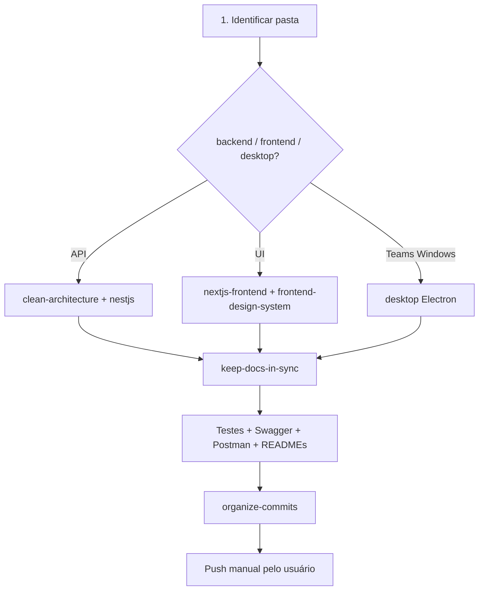

# Meeting Scribe — Development

**Autor:** Francisco Stanley Rodrigues Albuquerque

## Índice de Skills

| Skill | Quando carregar |
|-------|-----------------|
| `project-architecture` (rule) | Estrutura monorepo, pastas, portas |
| [frontend-design-system](../frontend-design-system/SKILL.md) | **UI/UX** — visual corporativo, tokens, componentes |
| [security-hardening](../security-hardening/SKILL.md) | **Segurança** — token API, Helmet, CSP, rate limit |
| [keep-docs-in-sync](../keep-docs-in-sync/SKILL.md) | **Sempre** ao fechar mudança (Swagger, Postman, testes, READMEs) |
| [clean-architecture](../../../../.cursor/skills/clean-architecture/SKILL.md) | Use cases, ports |
| [nestjs-services](../../../../.cursor/skills/nestjs-services/SKILL.md) | Backend NestJS |
| [nextjs-frontend](../../../../.cursor/skills/nextjs-frontend/SKILL.md) | Frontend Next.js |
| [organize-commits](../organize-commits/SKILL.md) | **Commits** — 1 alteração = 1 commit |
| [review-code](../../../../.cursor/skills/review-code/SKILL.md) | Review antes de push |

## Mapa do monorepo

| Pasta | Pacote | Stack |
|-------|--------|-------|
| `backend/` | `@meeting-scribe/backend` | NestJS + Prisma |
| `frontend/` | `@meeting-scribe/frontend` | Next.js |
| `desktop/` | `@meeting-scribe/desktop` | Electron |
| `packages/shared/` | `@meeting-scribe/shared` | Tipos, schedule, permissões, cores |
| `docs/` | — | architecture, security, realtime, postman |

## Fluxo ao implementar



## Definition of Done

Ver skill [keep-docs-in-sync](../keep-docs-in-sync/SKILL.md). Sem docs/testes/Swagger atualizados, a feature **não** está pronta para commit final.

## Comandos

```bash
copy .env.template .env   # ou cp no Linux
npm run dev               # local sem Docker (Whisper no Node)
npm run dev:local         # alias de npm run dev
./scripts/dev-local.sh    # Linux: install + dev
npm run docker:up         # compose completo (servidor)
npm run docker:deploy     # scripts/deploy-linux.sh
npm run dev:desktop
npm run db:migrate
npm run build
```

Docs: `docs/architecture.md` · `docs/dev-local.md` · `docs/deploy-linux.md` · `docs/security.md`
