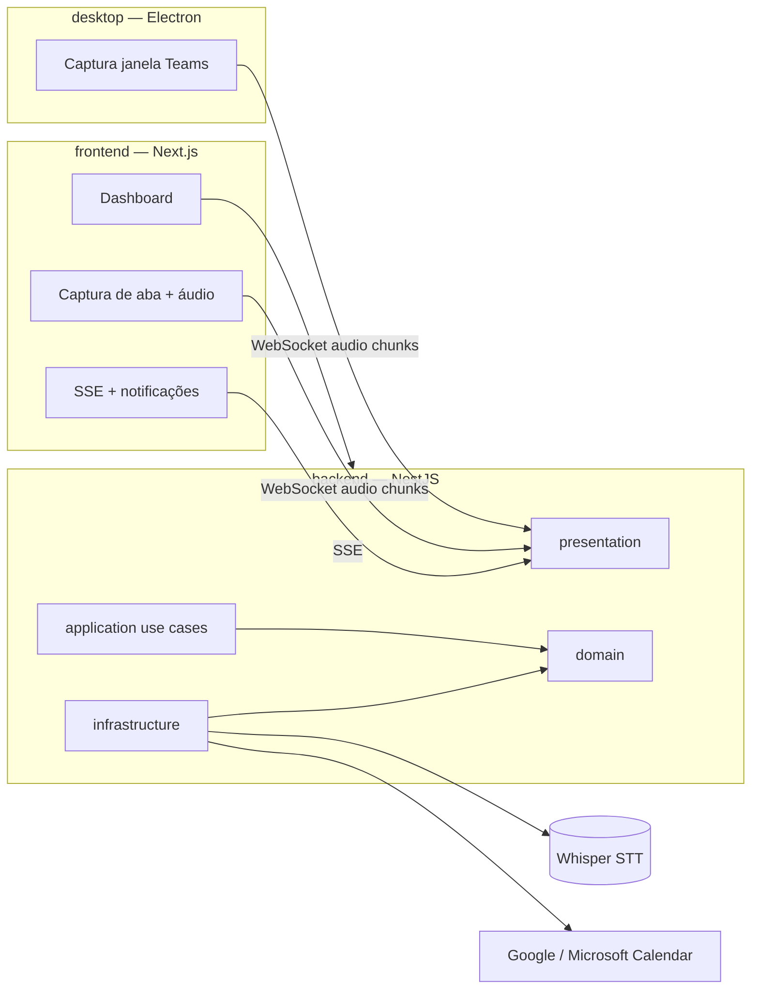

# Meeting Scribe

Sistema profissional para **detectar reuniões** (Google Calendar / Microsoft Teams), **pedir para participar com transcrição**, **capturar áudio da aba Meet/Teams** e **salvar transcrições organizadas** com falante e texto.

Stack: **NestJS** (Clean Architecture) + **Next.js** + **Prisma (SQLite)** + **WebSocket/SSE** + companion **Electron**.

## Estrutura do monorepo

```
meeting-scribe/
├── backend/           # NestJS API — Clean Architecture
├── frontend/          # Next.js App Router — dashboard e captura web
├── desktop/           # Electron — Teams desktop (Windows)
├── packages/
│   └── shared/        # Tipos e utilitários compartilhados
├── docker-compose.yml # Whisper STT local
└── package.json       # Workspaces npm
```

| Diretório | Pacote | Responsabilidade |
|-----------|--------|------------------|
| `backend/` | `@meeting-scribe/backend` | API REST, SSE, WebSocket, Prisma, calendários, STT |
| `frontend/` | `@meeting-scribe/frontend` | UI web, alertas, captura de aba Meet/Teams |
| `desktop/` | `@meeting-scribe/desktop` | Companion Windows para Teams fora do navegador |
| `packages/shared/` | `@meeting-scribe/shared` | Contratos TypeScript compartilhados |

## Arquitetura



| Camada (backend) | Responsabilidade |
|------------------|------------------|
| `domain` | Entidades, ports, regras (ex.: quando alertar reunião) |
| `application` | Use cases (sync calendário, transcrever chunk, salvar trecho) |
| `infrastructure` | Prisma, OAuth calendário, Whisper, scheduler |
| `presentation` | REST, SSE, WebSocket |

## Requisitos

- Node.js 20+
- Conta OAuth Google e/ou Microsoft (opcional, para detecção automática)
- Servidor STT compatível com OpenAI `/v1/audio/transcriptions` (recomendado: Docker Whisper abaixo)

## Configuração rápida

```powershell
cd C:\Users\Stanley\Downloads\AI_ANNOTATIONS
npm install
copy backend\.env.example backend\.env
copy frontend\.env.example frontend\.env.local
npm run db:generate
npm run db:migrate
docker compose up -d whisper   # opcional — STT local
npm run dev
```

Scripts úteis:

| Comando | Efeito |
|---------|--------|
| `npm run dev` | Backend + frontend juntos |
| `npm run dev:backend` | Só API (porta 3001) |
| `npm run dev:frontend` | Só Next.js (porta 3000) |
| `npm run dev:desktop` | Companion Teams desktop |
| `npm run build:backend` | Build shared + backend |
| `npm run build:frontend` | Build shared + frontend |

- Frontend: http://localhost:3000  
- Backend: http://localhost:3001  
- Swagger: http://localhost:3001/api/docs  

### STT (transcrição)

Sem `STT_BASE_URL`, o backend usa um adaptador de desenvolvimento (não transcreve de verdade).

Com Docker:

```env
STT_BASE_URL=http://localhost:8080/v1
```

Ajuste a URL conforme a imagem Whisper que você usar. Para **identificação de falantes**, use um backend STT que devolva `speaker` nos segmentos (ex.: pipeline WhisperX + diarização) — o port `SpeechToTextPort` já aceita `speakerLabel`.

### Calendários (detecção de reunião)

1. Em **Calendários**, conecte Google e/ou Microsoft.
2. O job roda a cada minuto: sincroniza eventos e, **~3 min antes** (`MEETING_ALERT_MINUTES`), envia alerta SSE + notificação do navegador.
3. O modal pergunta se você deseja **iniciar transcrição** e abrir o link da reunião.

Configure OAuth em `backend/.env` (`GOOGLE_*`, `MICROSOFT_*`).

## Fluxo na reunião (Teams / Meet)

### Meet ou Teams no **navegador**

1. Receba o alerta ou abra **Nova reunião manual**.
2. Vá em **Captura ao vivo** (`/sessions/{id}/capture`).
3. **Iniciar transcrição** → escolha a **aba** do Meet/Teams e marque **compartilhar áudio da aba**.
4. Trechos aparecem em tempo real e ficam persistidos em `TranscriptSegment` / `SpeakerProfile`.
5. **Encerrar captura** ao final da reunião.

### Microsoft Teams no **app desktop** (Windows)

Use o companion **Electron** em `desktop/`, pensado para quem entra na reunião pelo Teams instalado, fora do Chrome/Edge.

```powershell
copy desktop\.env.example desktop\.env
npm run dev:desktop
```

1. Deixe o backend rodando (`npm run dev:backend` ou `npm run dev`).
2. Abra o **Meeting Scribe Desktop** e entre na reunião pelo **app Teams**.
3. No alerta do calendário, use **Abrir no Teams (desktop)** (`msteams://…`) ou o botão equivalente no app.
4. Clique **Iniciar transcrição (Teams desktop)** — o app localiza a janela da reunião e captura o áudio (modo automático).
5. Se o áudio da janela não vier, use **Áudio do sistema (loopback)** (Windows 10/11).

O desktop escuta os mesmos alertas SSE do frontend e envia áudio pelo WebSocket `/transcription` para o backend.

## Licença e conformidade

Respeite as políticas da sua empresa e os termos do Google/Microsoft sobre gravação e transcrição. Este projeto é para uso pessoal/autorizado, com credenciais suas e STT self-hosted quando possível.

**Autor:** Francisco Stanley Rodrigues Albuquerque
