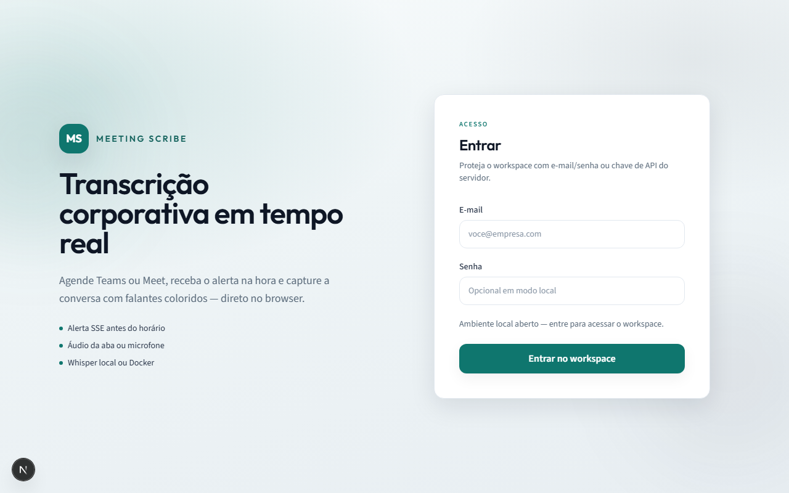

# Meeting Scribe

Transcrição em tempo real de reuniões (Meet / Teams) — **só rode o projeto**.

## Interface e funcionalidades

### Shell e navegação

Sidebar (desktop) / menu (mobile): **Home**, **Agenda**, **Calendário**, **API** (Swagger), **Sair**. Em editar, visualizar, agendar e captura há **Voltar**.

### Login

Tela `/login` com marca em destaque: e-mail/senha (ou chave de API). Sessão em cookie; workspace só após entrar. Ver [docs/security.md](docs/security.md).



### Lista de reuniões

Dashboard com status, plataforma e trechos. **Agendas não iniciadas**: Editar, Excluir (modal + toast) e Abrir. **Ao vivo ou concluídas**: Abrir (primário). Horários vencidos viram **Concluída** automaticamente.


### Alerta ao iniciar

Perto do horário agendado, o app pede **Participar e transcrever** — abre o link Meet/Teams e a tela de captura.


### Agendar / editar reunião

Calendário (**react-day-picker**) + horário, validação fim > início e sem início no passado. Formulário em seções com preview de duração.


### Calendários (ICS e OAuth)

Cole o endereço secreto iCal do Google/Outlook, ou conecte Google/Microsoft (Client ID gratuito). Ver [`docs/oauth-setup-gratis.md`](docs/oauth-setup-gratis.md).


### Transcrição por falante

Trechos com **cor distinta por participante** (ordem de aparição), horário e texto. Sem botão de captura se a reunião já estiver concluída.


### Captura ao vivo

**Áudio da aba** (Meet/Teams no Chrome) ou **microfone**. Whisper local processa a cada ~5s.


---

## Configuração de ambiente

```powershell
copy .env.template .env
```

Só isso. O `.env` fica na raiz (não vai pro Git).  
`npm run dev` / bootstrap gera `backend/.env`, `frontend/.env.local` e `desktop/.env` a partir dele.

OAuth e ICS são opcionais — deixe em branco no `.env` se não for usar.

## Uso local (sem Docker) — recomendado para testar

Guia: [docs/dev-local.md](docs/dev-local.md)

```powershell
copy .env.template .env
npm install
npm run dev
```

Linux:

```bash
cp .env.template .env
chmod +x scripts/dev-local.sh
./scripts/dev-local.sh
```

Isso automaticamente:

1. cria `.env` do backend/frontend/desktop  
2. aplica migrations do banco  
3. ativa **Whisper local** no Node (baixa o modelo na 1ª transcrição)  
4. sobe backend (`3001`) + frontend (`3000`) — **sem Docker**

Abra http://localhost:3000 → **Agendar reunião** (horário + link) → deixe a aba aberta → na hora **Participar e transcrever**.

Na captura: **Testar com microfone** ou áudio da aba Meet/Teams no Chrome. Protocolo: [docs/realtime.md](docs/realtime.md).

### Calendário (sem OAuth)

Em **Calendários**, cole o **endereço secreto iCal (ICS)** do Google/Outlook. O sistema detecta reuniões e avisa antes de começar.

### Google / Outlook automático (recomendado, gratuito)

Igual aos apps do mercado: você cria **uma vez** um Client ID gratuito (Google Cloud / Azure) — ver [`docs/oauth-setup-gratis.md`](docs/oauth-setup-gratis.md) — coloca no `.env`, e depois só:

1. **Calendários** → **Conectar Google** ou **Conectar Outlook / Teams**
2. Aceitar permissões na tela oficial
3. O sistema sincroniza Meet/Teams sozinho e alerta antes da reunião

Não há mensalidade: as APIs de calendário têm cota gratuita suficiente para uso pessoal.

### Teams desktop

```powershell
npm run dev:desktop
```

## Uso com Docker / servidor Linux

```bash
cp .env.template .env
# No servidor: edite NEXT_PUBLIC_API_URL, NEXT_PUBLIC_WS_URL e CORS_ORIGIN com o IP/domínio
chmod +x scripts/deploy-linux.sh
./scripts/deploy-linux.sh
```

Guia completo: [docs/deploy-linux.md](docs/deploy-linux.md)

Fluxo: **Agendar reunião** (horário + link) → deixe a aba aberta → na hora o app pede **Participar e transcrever**.

Sobe **frontend** (`3000`), **backend** (`3001`) e **Whisper** (`8080`).

- App: http://localhost:3000 (ou IP do servidor)  
- API / Swagger: **http://localhost:3001/api/docs** (não use a porta 3000)  
- Postman: [docs/postman/meeting-scribe.postman_collection.json](docs/postman/meeting-scribe.postman_collection.json)
- Arquitetura e fluxogramas: [docs/architecture.md](docs/architecture.md)

Dockerfiles multi-stage: `backend/Dockerfile` e `frontend/Dockerfile`.

## Estrutura

```
backend/           NestJS + Whisper + Prisma
frontend/          Next.js (sidebar, formulários, captura)
desktop/           Electron (Teams Windows)
packages/shared/   Tipos, permissões, schedule, cores, Teams links
docs/              Arquitetura, Postman, realtime, deploy, OAuth, screenshots
.env.template      Fonte única de env
```

## Documentação e qualidade

Wiki oficial: [GitHub Wiki](https://github.com/FranciscoStanley/meeting_scribe_annotations/wiki)  
Ao mudar código, a rule **`keep-docs-in-sync`** exige atualizar Swagger, Postman, testes e READMEs.  
Arquitetura e fluxogramas: [docs/architecture.md](docs/architecture.md).  
UI: rule/skill `frontend-design-system`. Segurança: [docs/security.md](docs/security.md).  
Se a UI mudar de forma relevante, atualize `docs/screenshots/`.  
Commits: **1 alteração = 1 commit** (`organize-commits`); **push é manual**. Branch `master` protegida (sem force push; CI + PR).

## Segurança

Ver [docs/security.md](docs/security.md). Em produção defina `API_ACCESS_TOKEN`, `APP_AUTH_EMAIL` / `APP_AUTH_PASSWORD` e `SECURITY_REQUIRE_TOKEN=true`. Local pode ficar vazio (modo aberto após a tela de login).

**Repositório público:** nunca commite `.env` nem secrets; o `.gitignore` já cobre `.env*`, bancos e chaves. Use só `.env.template` com placeholders.

## Opcional

| Recurso | Como |
|---------|------|
| Whisper via Docker (mais rápido) | `npm run dev:with-docker-stt` ou `docker compose up -d whisper` + `STT_BASE_URL=http://localhost:8080/v1` |
| Google/Microsoft OAuth | preencher `GOOGLE_*` / `MICROSOFT_*` no `.env` da raiz |

**Autor:** Francisco Stanley Rodrigues Albuquerque
