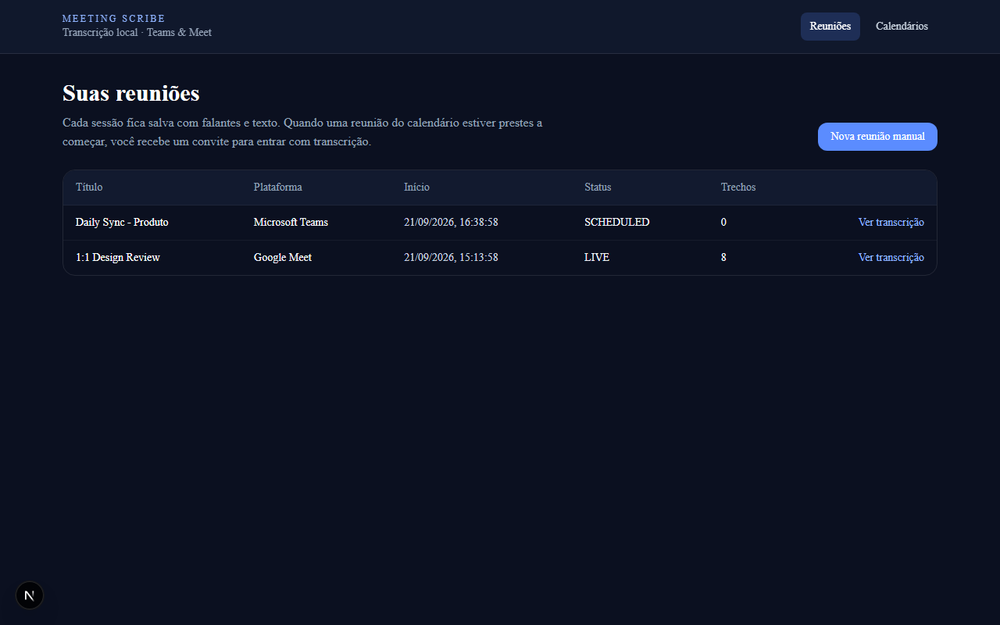
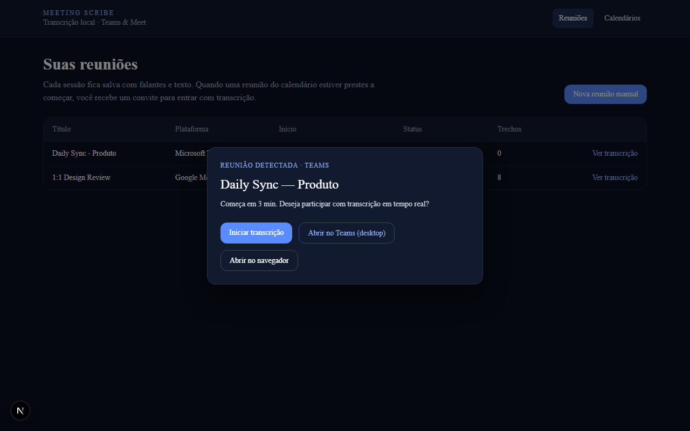
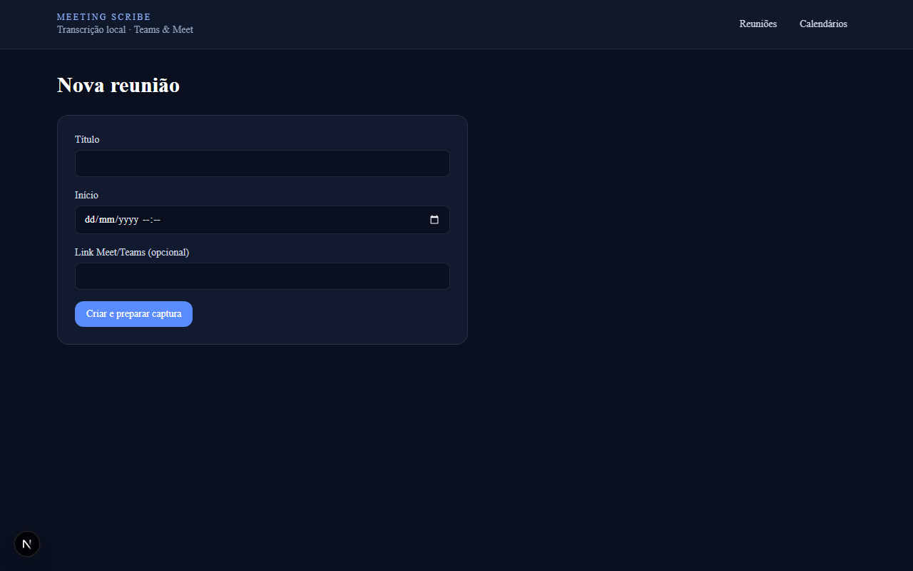
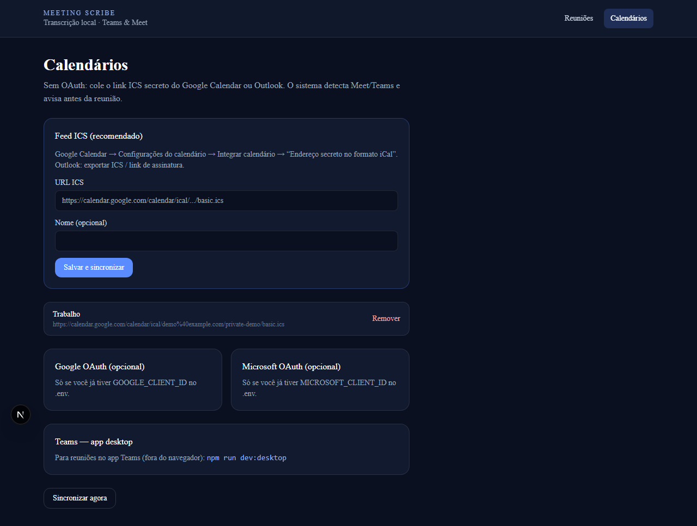
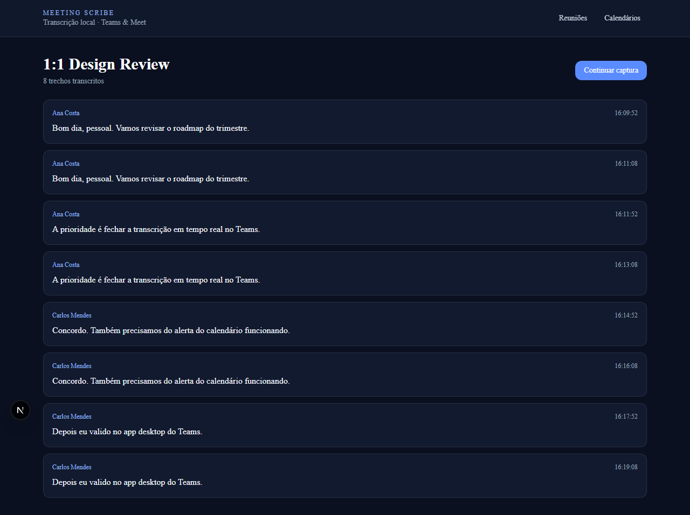
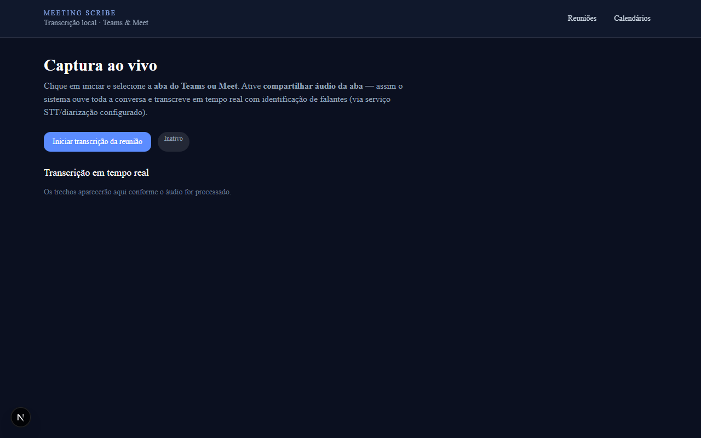

# Meeting Scribe

Transcrição em tempo real de reuniões (Meet / Teams) — **só rode o projeto**.

## Interface e funcionalidades

### Lista de reuniões

Dashboard com status (SCHEDULED / LIVE / COMPLETED), plataforma (Teams ou Meet) e quantidade de trechos. Cada sessão pode ser aberta para ver a transcrição completa.



### Alerta ao detectar reunião

Quando o calendário indica que uma reunião está para começar, o app pede para participar com transcrição — incluindo abrir no **Teams desktop** (`msteams://`).



### Nova reunião manual

Crie uma sessão na hora (sem calendário): título, horário e link Meet/Teams opcional.



### Calendários (ICS sem OAuth)

Cole o endereço secreto iCal do Google/Outlook. OAuth Google/Microsoft continua disponível se você preencher o `.env`.



### Transcrição por falante

Trechos salvos com **nome do falante**, horário e texto — organizados por reunião.



### Captura ao vivo

Compartilhe a **aba** do Meet/Teams com áudio; o sistema envia chunks ao backend e exibe a transcrição em tempo real.



---

## Configuração de ambiente

```powershell
copy .env.template .env
```

Só isso. O `.env` fica na raiz (não vai pro Git).  
`npm run dev` / bootstrap gera `backend/.env`, `frontend/.env.local` e `desktop/.env` a partir dele.

OAuth e ICS são opcionais — deixe em branco no `.env` se não for usar.

## Uso com Docker (recomendado em produção/local completo)

```powershell
copy .env.template .env
docker compose up --build
```

Sobe **frontend** (`3000`), **backend** (`3001`) e **Whisper** (`8080`).

- App: http://localhost:3000  
- API / Swagger: http://localhost:3001/api/docs  
- Postman: [docs/postman/meeting-scribe.postman_collection.json](docs/postman/meeting-scribe.postman_collection.json)

Dockerfiles multi-stage: `backend/Dockerfile` e `frontend/Dockerfile`.

## Uso local (Node, sem Docker das apps)

```powershell
cd C:\Users\Stanley\Downloads\AI_ANNOTATIONS
copy .env.template .env
npm install
npm run dev
```

Isso automaticamente:

1. cria `.env` do backend/frontend/desktop  
2. aplica migrations do banco  
3. ativa **Whisper local** (baixa o modelo na 1ª execução)  
4. sobe backend (`3001`) + frontend (`3000`)

Abra http://localhost:3000 → **Nova reunião manual** → **Iniciar transcrição** → escolha a aba Meet/Teams com **compartilhar áudio**.

### Calendário (sem OAuth)

Em **Calendários**, cole o **endereço secreto iCal (ICS)** do Google/Outlook. O sistema detecta reuniões e avisa antes de começar.

### Teams desktop

```powershell
npm run dev:desktop
```

## Estrutura

```
backend/           NestJS + Whisper + Prisma
frontend/          Next.js
desktop/           Electron (Teams Windows)
packages/shared/   Tipos compartilhados
docs/postman/      Collection HTTP
docs/screenshots/  Prints da UI (README)
.env.template      Fonte única de env
```

## Documentação e qualidade

Ao mudar código, a rule **`keep-docs-in-sync`** exige atualizar Swagger, Postman, testes e READMEs.  
Se a UI mudar de forma relevante, atualize também `docs/screenshots/` (`node scripts/capture-screenshots.cjs`).  
Commits semânticos atômicos; **push é manual**.

## Opcional

| Recurso | Como |
|---------|------|
| Whisper via Docker (mais rápido) | `docker compose up -d whisper` e `STT_BASE_URL=http://localhost:8080/v1` |
| Google/Microsoft OAuth | preencher `GOOGLE_*` / `MICROSOFT_*` no `.env` da raiz |

**Autor:** Francisco Stanley Rodrigues Albuquerque
