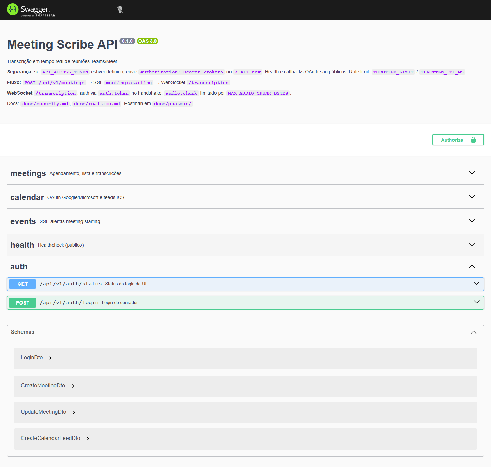
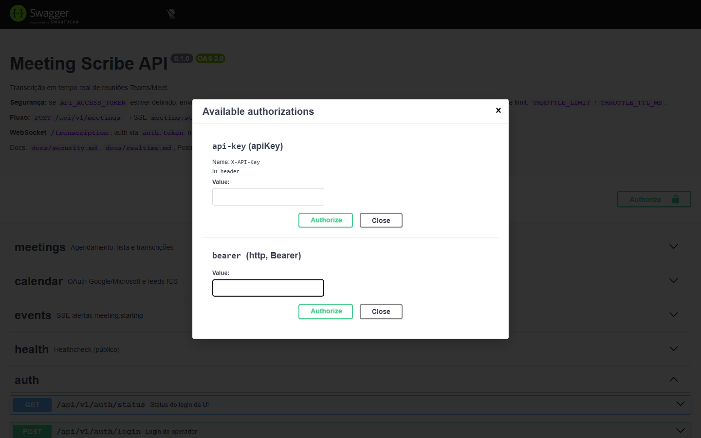
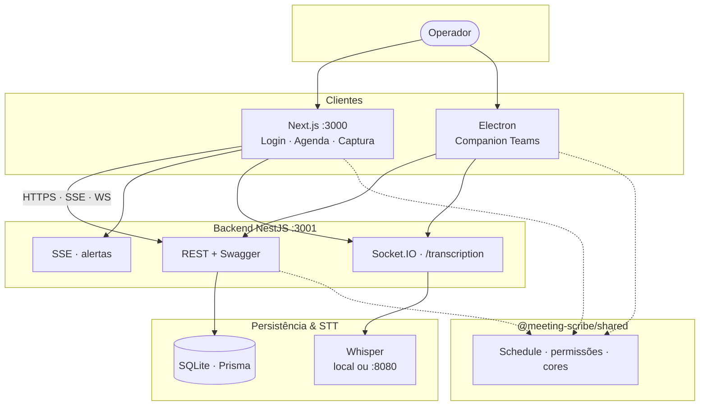
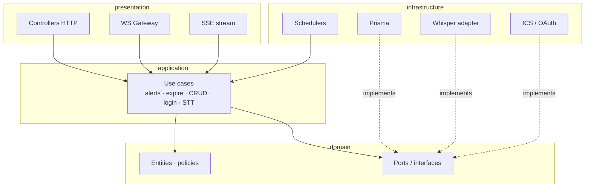
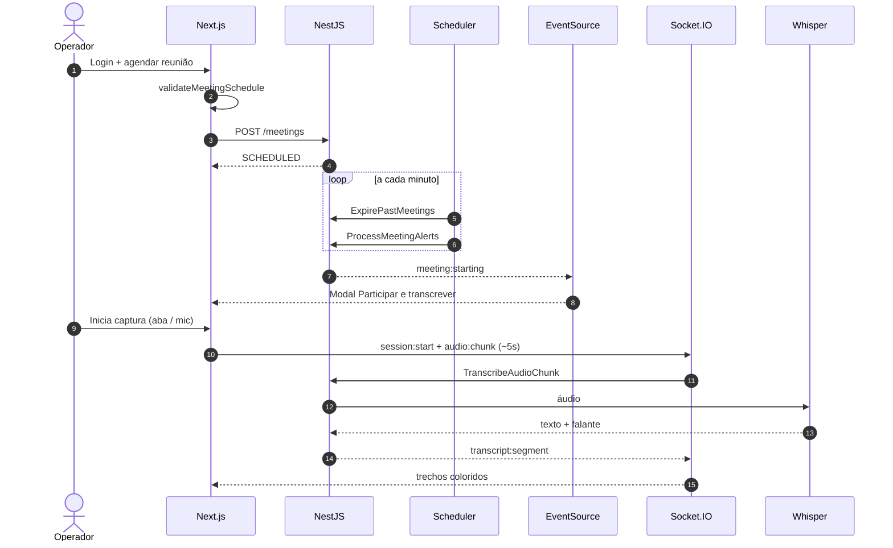
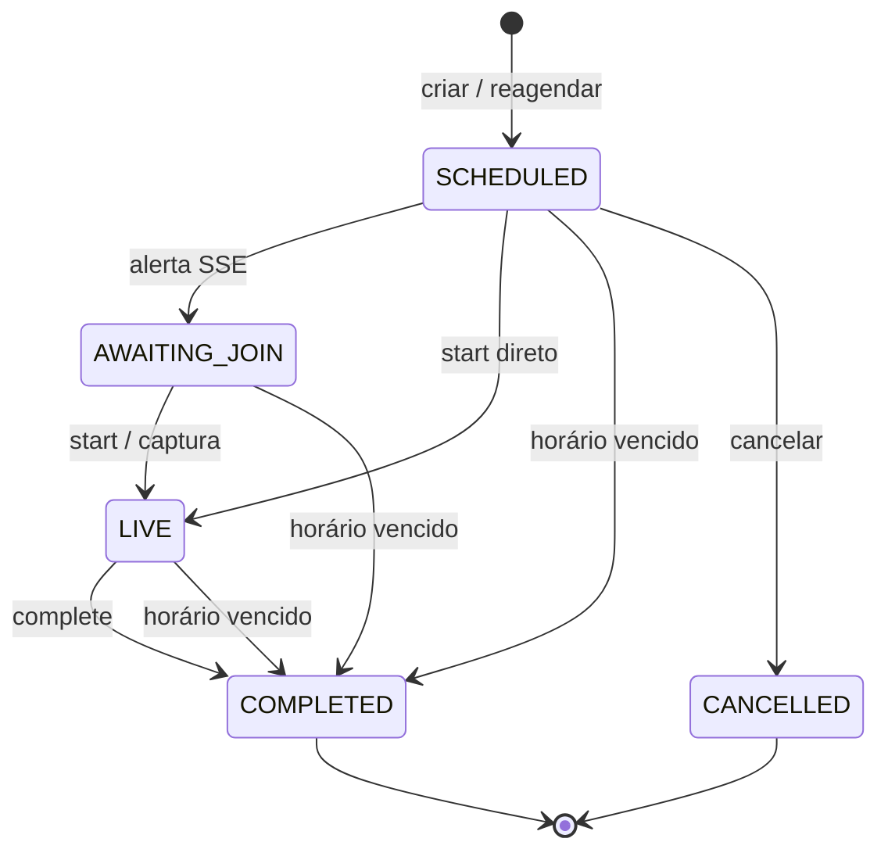

# Meeting Scribe

[](https://github.com/FranciscoStanley/meeting_scribe_annotations/actions/workflows/ci.yml)
[](LICENSE)
[](.nvmrc)
[](https://github.com/FranciscoStanley/meeting_scribe_annotations/wiki)

**Transcrição corporativa em tempo real** de reuniões Microsoft Teams e Google Meet — monorepo fullstack (NestJS · Next.js · Electron · Whisper).

> Portfólio de engenharia de **Francisco Stanley Rodrigues Albuquerque**.  
> Pensado para demonstrar nível **fullstack sênior**: arquitetura limpa, segurança self-hosted, UX corporativa, realtime e disciplina de entrega (CI, PRs, docs).

---

## Por que existe

Equipes precisam de atas fiéis sem gravar a reunião em silo externo. Meeting Scribe é **self-hosted**: agenda o horário, alerta na hora certa, captura áudio no browser (ou companion Windows) e devolve trechos por falante — com controle de acesso e sem depender de SaaS de transcrição.

## O que entrega

| Capacidade | Detalhe |
|------------|---------|
| Agenda + alerta | Cron + SSE `meeting:starting` → modal **Participar e transcrever** |
| Captura | Áudio da aba (Meet/Teams no Chrome) ou microfone |
| STT | Whisper local (`@xenova/transformers`) ou Docker |
| Calendário | ICS e OAuth Google/Microsoft (cota gratuita) |
| Auth | Login UI + token de API (Helmet, throttle, CSP) |
| API | OpenAPI/Swagger + Postman versionados |

### Interface web


### API — Swagger (OpenAPI)

http://localhost:3001/api/docs · Authorize com Bearer ou `X-API-Key`.





---

## Arquitetura

Visão em camadas do monorepo — o mesmo desenho aparece na [Wiki · Architecture](https://github.com/FranciscoStanley/meeting_scribe_annotations/wiki/Architecture) e em [`docs/architecture.md`](docs/architecture.md).

### Visão de contexto (C4 leve)



### Clean Architecture (backend)



### Fluxo ponta a ponta



### Ciclo de vida da agenda



| Pacote | Responsabilidade |
|--------|------------------|
| `frontend/` | UX corporativa, login, captura, SSE |
| `backend/` | Domínio, use cases, cron, REST, WS, SSE |
| `desktop/` | Companion Teams (Windows) |
| `packages/shared/` | Contratos e regras compartilhadas |

**Decisões:** shared evita drift UI/API · SSE para alerta leve · Socket.IO para áudio · Whisper local por default.  
ADRs: [`docs/decisions.md`](docs/decisions.md)

---

## Stack

| Camada | Tecnologias |
|--------|-------------|
| Frontend | Next.js 15, React 19, Tailwind, react-day-picker, react-toastify |
| Backend | NestJS, Prisma, SQLite, Helmet, Throttler, Schedule |
| Desktop | Electron |
| STT | Whisper local ou container |
| Qualidade | Vitest, TypeScript, Conventional Commits, branch protection, Wiki |

---

## Quick start

```powershell
copy .env.template .env
npm install
npm run dev
```

1. http://localhost:3000/login → **Entrar no workspace**  
2. Agendar reunião (horário + link)  
3. Na hora: **Participar e transcrever** · captura por aba ou mic  

| Serviço | URL |
|---------|-----|
| App | http://localhost:3000 |
| Swagger | http://localhost:3001/api/docs |
| Health | http://localhost:3001/health |

Guias: [dev local](docs/dev-local.md) · [deploy Linux](docs/deploy-linux.md) · [Wiki](https://github.com/FranciscoStanley/meeting_scribe_annotations/wiki)

---

## Segurança (resumo)

| Camada | Mecanismo |
|--------|-----------|
| UI | `/login` + cookies de sessão · middleware |
| API | `API_ACCESS_TOKEN` · Bearer / X-API-Key |
| Produção | `APP_AUTH_*` + `SECURITY_REQUIRE_TOKEN=true` |
| HTTP | Helmet · throttle · ValidationPipe |
| Frontend | CSP · frame-deny · nosniff |
| WS | Auth no handshake · limite de chunk |

Detalhes: [`docs/security.md`](docs/security.md) · política: [`SECURITY.md`](SECURITY.md)

**Repo público:** nunca commite `.env`. O `.gitignore` cobre secrets, bancos e chaves.

---

## Qualidade e engenharia

```bash
npm run test -w @meeting-scribe/shared
npm run test -w @meeting-scribe/backend
npm run test -w @meeting-scribe/frontend
npm run lint
```

- Commits **atômicos** (Conventional Commits) · 1 alteração = 1 commit  
- `master` **protegida** (sem force push; merge via PR)  
- DoD: código + testes + Swagger/Postman + README/wiki quando o contrato ou a UI mudam  
- Templates de Issue/PR · Code of Conduct · License MIT  

Contribuir: [`CONTRIBUTING.md`](CONTRIBUTING.md)

---

## O que este repositório demonstra (avaliação sênior)

1. **Fullstack de ponta a ponta** — UI, API, realtime, desktop, STT  
2. **Arquitetura** — Clean Architecture, monorepo, pacote compartilhado  
3. **Produto** — fluxos reais (agenda → alerta → captura → transcrição)  
4. **Segurança self-hosted** — auth em camadas, headers, limites, threat model documentado  
5. **DX e governança** — CI, proteção de branch, wiki, Postman/Swagger, skills/rules Cursor  
6. **UX corporativa** — design system próprio (não template genérico de IA)

---

## Estrutura

```
backend/           NestJS + Prisma + Whisper
frontend/          Next.js (login, sidebar, captura)
desktop/           Electron (Teams Windows)
packages/shared/   Contratos e regras compartilhadas
docs/              Architecture, security, Postman, screenshots, wiki/
.github/           CI, templates de Issue/PR
.env.template      Única fonte de env (copy → .env)
```

## Opcional

| Recurso | Como |
|---------|------|
| Whisper Docker | `npm run dev:with-docker-stt` ou `STT_BASE_URL=http://localhost:8080/v1` |
| OAuth calendário | `GOOGLE_*` / `MICROSOFT_*` — [guia grátis](docs/oauth-setup-gratis.md) |
| Desktop Teams | `npm run dev:desktop` |

---

**Autor:** [Francisco Stanley Rodrigues Albuquerque](https://github.com/FranciscoStanley)  
**Wiki:** [meeting_scribe_annotations/wiki](https://github.com/FranciscoStanley/meeting_scribe_annotations/wiki)  
**Licença:** [MIT](LICENSE)
