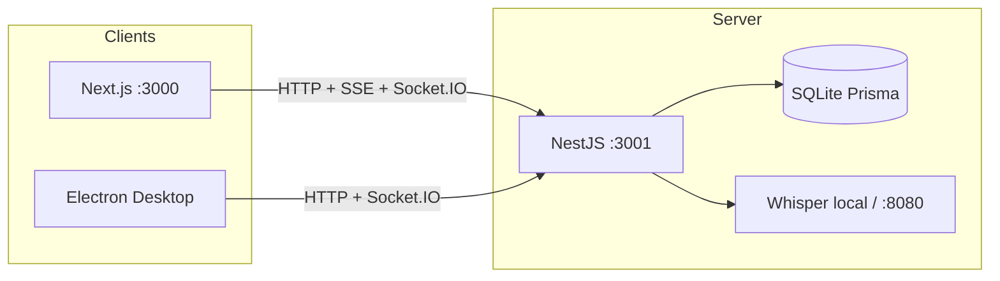
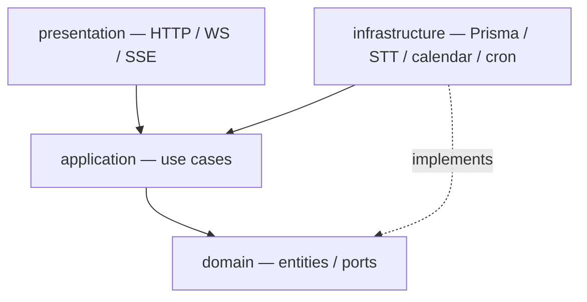
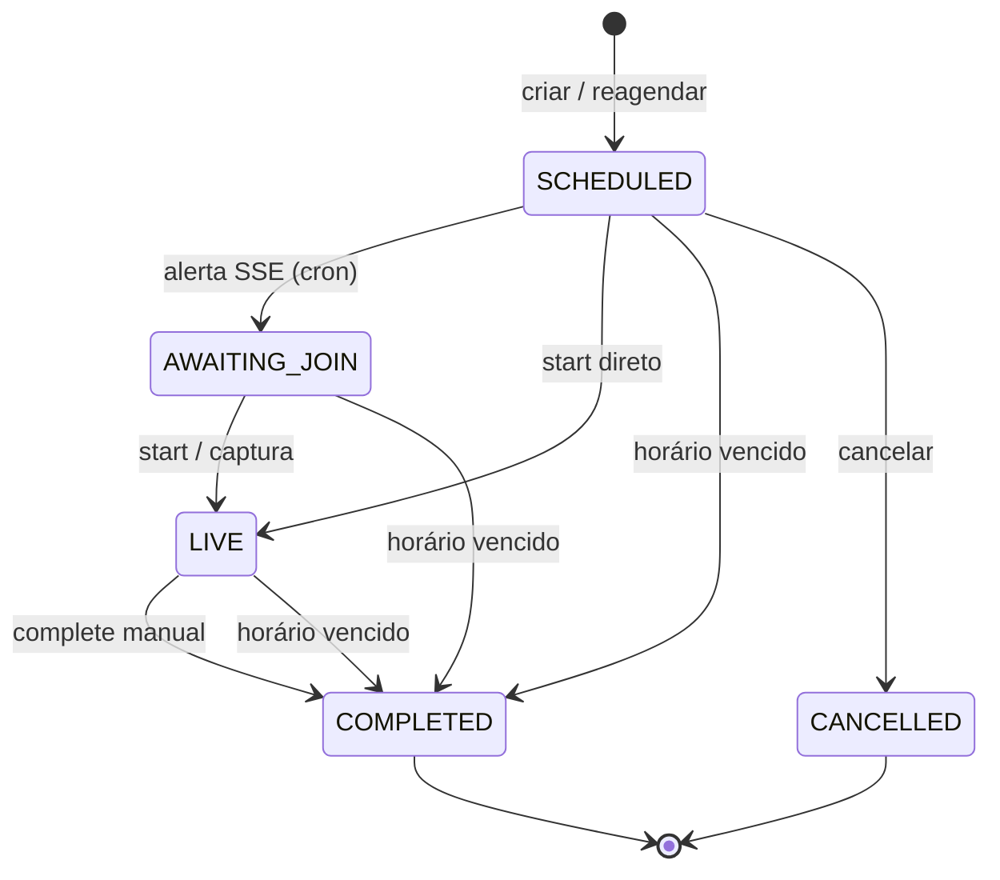
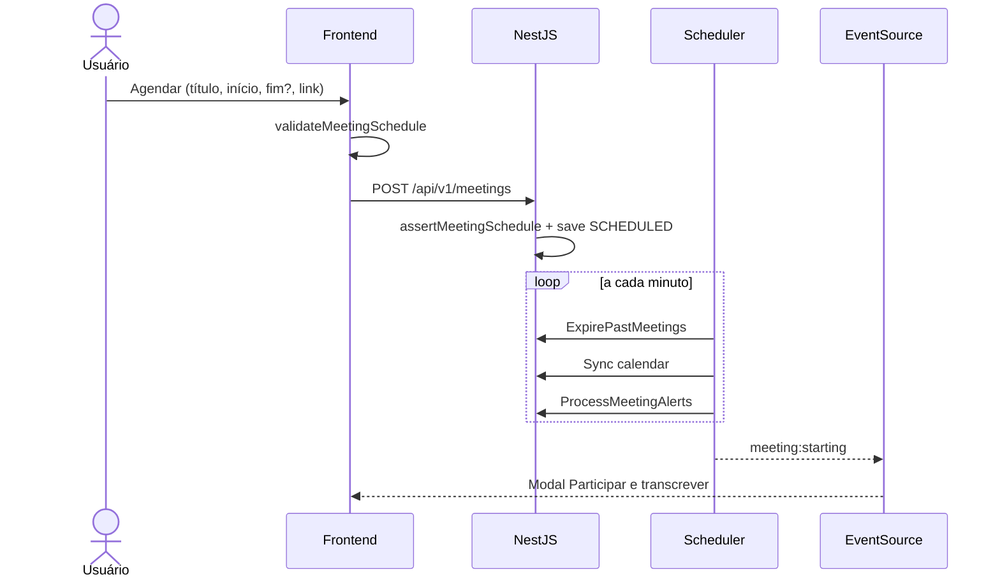
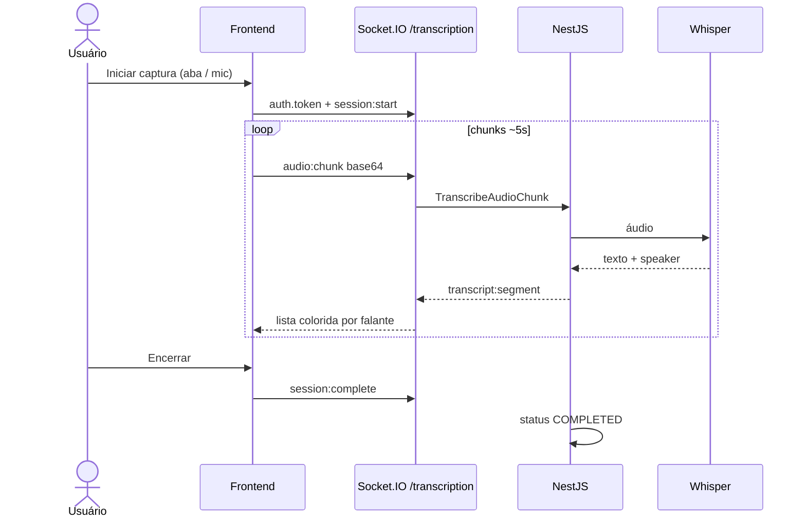
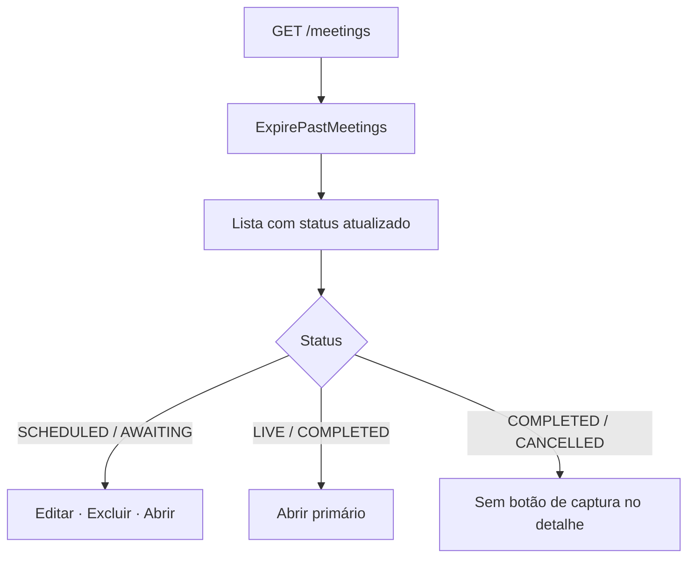

# Arquitetura técnica — Meeting Scribe

**Autor:** Francisco Stanley Rodrigues Albuquerque  
**Versão do documento:** 1.2 · monorepo NestJS + Next.js + Electron

## 1. Visão geral

Meeting Scribe agenda reuniões (Teams/Meet), alerta perto do horário, captura áudio no browser/desktop e transcreve via Whisper (local ou Docker). Persistência em SQLite (Prisma).



| Pacote | Papel |
|--------|--------|
| `frontend/` | UI corporativa (sidebar), captura aba/mic, SSE alertas, toasts/modais |
| `backend/` | Domínio, use cases, cron (alerta + expire), REST, WS, SSE |
| `desktop/` | Companion Teams Windows |
| `packages/shared/` | Tipos, permissões, cores, validação de horário |

Docs de referência: [security.md](security.md) · [realtime.md](realtime.md) · Postman em `docs/postman/`.

## 2. Clean Architecture (backend)



Regras: domínio sem Nest; use cases orquestram ports; adapters em infrastructure.

## 3. Ciclo de vida da agenda

### 3.1 Status



### 3.2 Encerramento automático por data

Fim efetivo = `scheduledEnd` **ou** `scheduledStart + MEETING_DEFAULT_DURATION_MINUTES`.

Se **início e fim efetivo** já passaram → `COMPLETED` (`ExpirePastMeetingsUseCase`).

Disparado por: cron (1 min), `GET /meetings`, detalhe e transcrição.

### 3.3 Validação de horários

| Camada | Regra |
|--------|--------|
| Shared `validateMeetingSchedule` | Início válido; fim > início; opcional rejeitar passado |
| Formulários (DateTimeField) | `rejectPastStart: true` + calendário `react-day-picker` |
| API create/update | `assertMeetingSchedule` (fim > início; passado permitido p/ sync calendário) |

## 4. Fluxos de processo

### 4.1 Agendar e alertar



### 4.2 Captura e transcrição



### 4.3 Lista e UI de ações



## 5. Frontend — UI e formulários

### 5.1 Shell

- `Sidebar`: Home · Agenda · Calendário · API (Swagger)
- `BackLink` em editar / visualizar / agendar / captura / calendários
- `ConfirmDialog` + `react-toastify` para exclusão e feedback

### 5.2 Datas

- Lib: **react-day-picker** + **date-fns** (`pt-BR`)
- `DateTimeField`: calendário + horário; popover via **portal** no `document.body` (evita corte por `overflow`)
- `MeetingScheduleForm`: seções Identidade / Horário / Link + duração
- Validação: `validateMeetingSchedule` (shared)

### 5.3 Transcrição

- Cores: `buildSpeakerColorMap` (ordem de aparição)
- Sem botão de captura se `meetingCanCapture` for false (`COMPLETED` / `CANCELLED`)

## 6. Segurança (resumo)

Ver [security.md](security.md). Token opcional em local; obrigatório em produção. Helmet, throttle, CSP no Next, auth no WS.

## 7. Portas e artefatos

| Serviço | Porta |
|---------|-------|
| Frontend | 3000 |
| Backend / Swagger | 3001 (`/api/docs`) |
| Whisper Docker | 8080 |

| Doc | Conteúdo |
|-----|----------|
| Este arquivo | Arquitetura + fluxogramas |
| [realtime.md](realtime.md) | SSE / Socket.IO |
| [security.md](security.md) | Hardening |
| Postman | `docs/postman/` |

## 8. Testes relevantes

| Pacote | Specs |
|--------|--------|
| `packages/shared` | `meeting-schedule`, `meeting-permissions`, `speaker-color`, `teams-links` |
| `backend` | entity auto-complete / shouldAlert, ExpirePastMeetings, schedule assert, API guard |
| `frontend` | `datetime.spec.ts` (Vitest) |

```bash
npm run test -w @meeting-scribe/shared
npm run test -w @meeting-scribe/backend
npm run test -w @meeting-scribe/frontend
```
