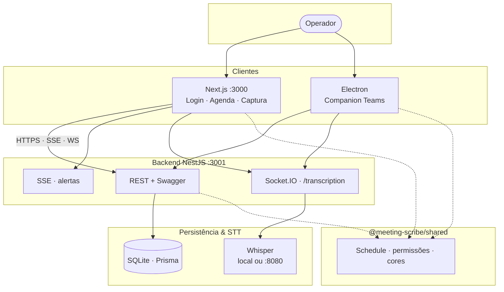
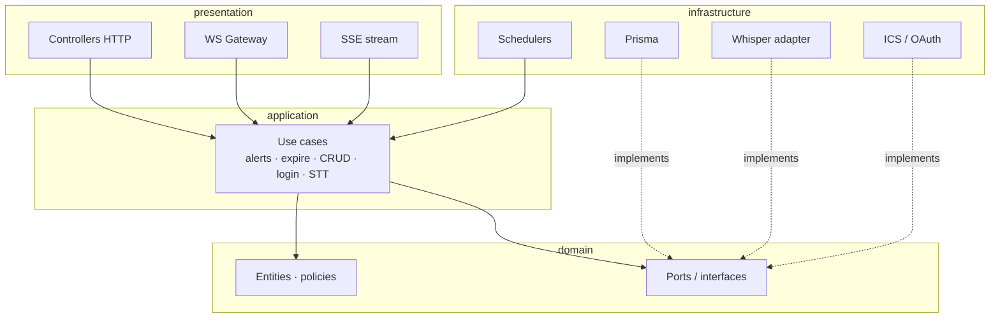
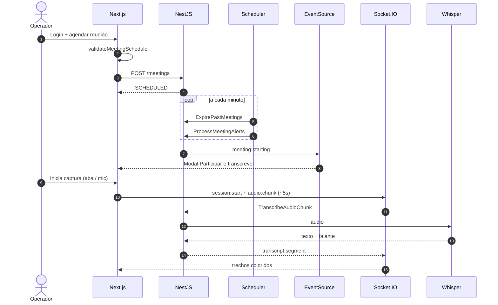
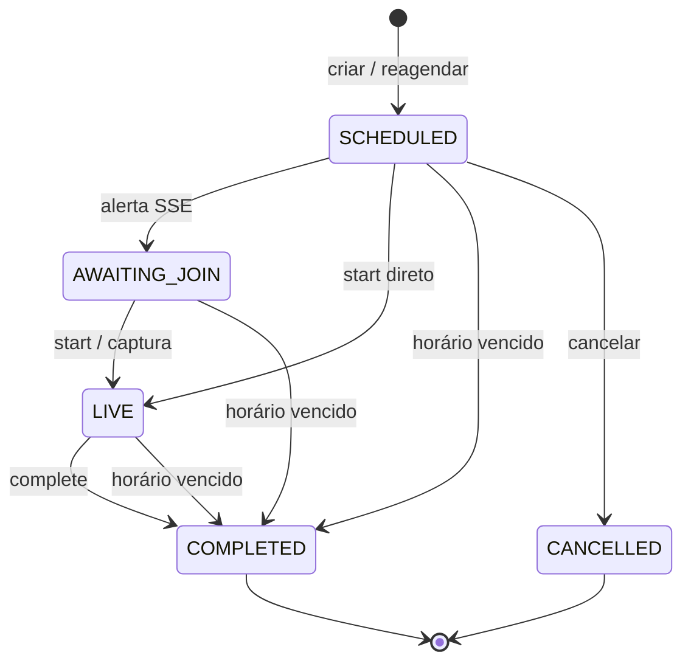
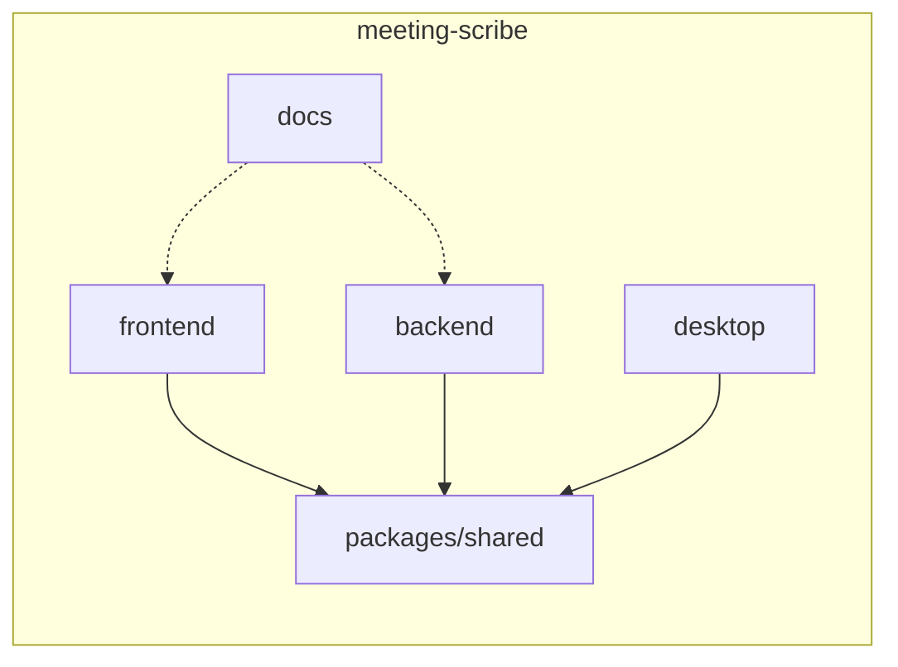

# Architecture

Visão técnica do monorepo Meeting Scribe — diagramas pensados para review de engenharia.

**Autor:** Francisco Stanley Rodrigues Albuquerque

## Visão de contexto

## Pacotes

| Pasta | Papel |
|-------|--------|
| `frontend/` | Next.js — login, sidebar, agenda, captura, SSE |
| `backend/` | NestJS — domínio, use cases, cron, REST, WS, SSE |
| `desktop/` | Electron — companion Teams Windows |
| `packages/shared/` | Tipos, permissões, cores, validação de horário |
| `docs/` | Architecture, security, Postman, screenshots |

## Clean Architecture (backend)

- Domínio **sem** dependência Nest  
- Use cases orquestram ports  
- Adapters em `infrastructure/`

## Fluxo ponta a ponta

## Ciclo de vida da agenda

**Encerramento automático:** fim efetivo = `scheduledEnd` **ou** `scheduledStart + MEETING_DEFAULT_DURATION_MINUTES`.  
Use case: `ExpirePastMeetingsUseCase` (cron + listagens).

## Mapa do monorepo

## Documentação no repo

Espelho completo: [`docs/architecture.md`](https://github.com/FranciscoStanley/meeting_scribe_annotations/blob/master/docs/architecture.md)  
ADRs: [`docs/decisions.md`](https://github.com/FranciscoStanley/meeting_scribe_annotations/blob/master/docs/decisions.md)
