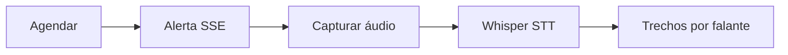
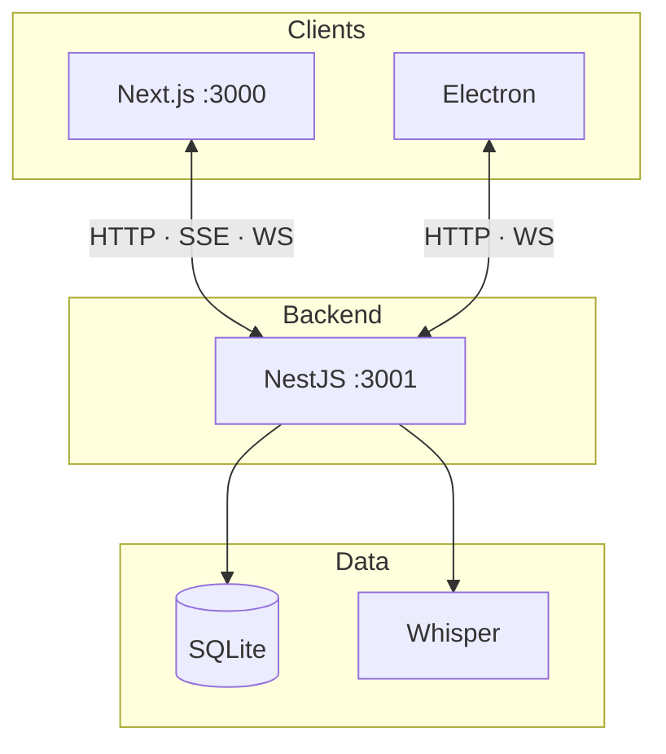

# Meeting Scribe — Wiki

Documentação oficial do **Meeting Scribe**: transcrição corporativa em tempo real de reuniões **Microsoft Teams** e **Google Meet**.

**Autor:** Francisco Stanley Rodrigues Albuquerque  
**Repositório:** [FranciscoStanley/meeting_scribe_annotations](https://github.com/FranciscoStanley/meeting_scribe_annotations)

## O que é

Aplicação **self-hosted** (monorepo) que agenda, alerta, captura e transcreve — com auth, Swagger e Whisper local ou Docker.

## Visão de arquitetura

Detalhes com Clean Architecture, sequência e estados: **[Architecture](Architecture)**.

## Comece por aqui

| Página | Conteúdo |
|--------|----------|
| [Getting Started](Getting-Started) | Setup em minutos |
| [Local Development](Local-Development) | Sem Docker, no seu PC |
| [Architecture](Architecture) | Diagramas Mermaid · camadas · fluxos |
| [Authentication and Login](Authentication-and-Login) | `/login`, tokens e sessão |
| [Security](Security) | Hardening e checklist |
| [Realtime](Realtime-SSE-and-WebSocket) | SSE e Socket.IO |
| [API and Postman](API-and-Postman) | HTTP, Swagger e collection |
| [OAuth Calendar](OAuth-Calendar) | Google / Microsoft grátis |
| [Deploy Linux](Deploy-Linux) | Docker no servidor |
| [Frontend UI](Frontend-UI) | Design system e telas |
| [Contributing](Contributing) | Commits, CI e branch protegida |

## Stack e portas

| Camada | Tecnologia | Porta |
|--------|------------|-------|
| Frontend | Next.js 15 · Tailwind | `3000` |
| Backend / Swagger | NestJS · Prisma | `3001` |
| Whisper Docker | opcional | `8080` |
| Desktop | Electron | — |

## Para avaliadores (empresas)

O [README](https://github.com/FranciscoStanley/meeting_scribe_annotations#readme) apresenta o projeto como portfólio **fullstack sênior**: problema, arquitetura (Mermaid), segurança, prints (web + Swagger), ADRs e governança.

Licença MIT · [SECURITY.md](https://github.com/FranciscoStanley/meeting_scribe_annotations/blob/master/SECURITY.md) · [CONTRIBUTING](https://github.com/FranciscoStanley/meeting_scribe_annotations/blob/master/CONTRIBUTING.md)

**Não** versione secrets: `.env.template` → `.env` (fora do Git).
